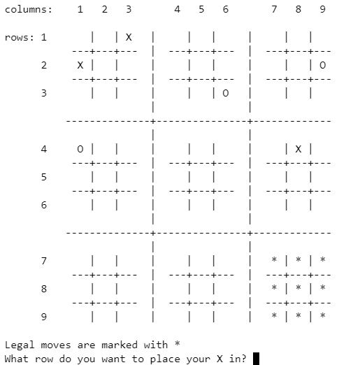
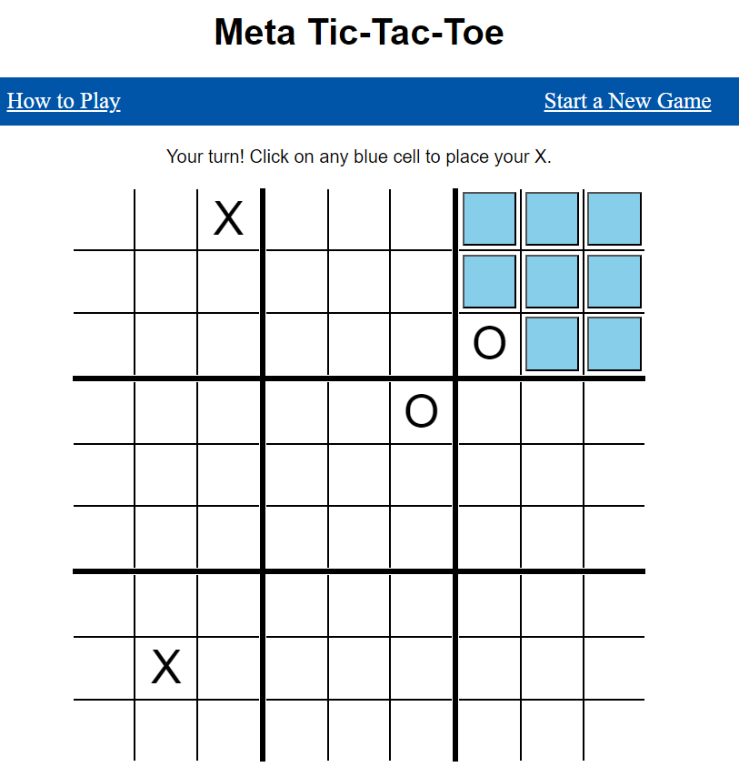

# Meta Tic-Tac-Toe
### Video Demo:  https://youtu.be/WN8cOgqt7lo
## Description:
This program is the final project for CS50P.
Meta Tic-Tac-Toe is also known as Ultimate Tic-Tac-Toe and Super Tic-Tac-Toe.  The game grid consists of a small tic-tac-toe grid inside each cell of a large tic-tac-toe grid.

The project has three parts: a terminal game, pytest tests for the terminal game, and a web based game.

I used Python, Flask, HTML, and CSS.

## Using the programs
To run the terminal program type *python project.py* in the terminal.

To run the tests type *pytest test_project.py* in the terminal.

To run the web based game type *python projectweb.py* in the terminal.

## The Terminal Game
The Grid class stores information about the current state of a grid.

The status attribute stores whether a grid has been won by 'X' or 'O' or is 'full' or is still 'free' to play in.

The cells attribute is a list that stores whether each cell has been chosen by 'X' or 'O' or is free (' ') or is a possible next choice ('*').

### Functions

### calculate_moves
Whichever small cell that last player played in is the big cell the next player is allowed to play in.
If the big cell is already won or is full, all available cells become possible moves.

This function sets all the possible moves to '*' and all other moves to ' '.

### check_for_full and check_for_win
These functions takes a grid and returns whether it is full or it has 3-in-a-row respectively.

### get_computer_move
This function takes a list of all possible moves and filters out those moves that would result in the user having all possible cells as their next move.

I would like to eventually make this smarter, but right now it just chooses a random move from this list.

### get_user_move
This function inputs a user row and column choice, converts it to grid and cell format, and checks to make sure it is a valid move.

### print_board
This function prints the current board.

I started with python-tabulate to make the game grid but I couldn't get what I wanted so eventually made my own similar to that.

<!--  -->

### Game Play

The user plays first.  The board is displayed and all possible moves are marked with a '*'.  The user is asked for the row and column of their choice.
An 'X' is placed in that cell.

It is then the computer's turn.  There is a pause for the computer to "think" of a move.  The computer announces the row and column of their move and then there is another pause to give the user time to process that move.

The turns toggle back and forth.

If a small grid is won, instead of the board displaying that grid, it will now display either an 'X' or an 'O'.

The game ends when one person gets three cells in a row in the big grid or there are no more moves left.

## Testing

The pytest program tests the functions calculate_moves, check_for_full, check_for_win, and get_computer_move.

### calculate_moves
From a newly initialized board, checks if moves contains every cell.

From the last player choosing a move in small cell 2, checks if moves contains only cells in big grid 2.

From the last player choosing a move in small cell 3 but big grid has been already won, checks if move contains all cells outside grid 3.

From the last player choosing a move in small cell 3 but big grid 3 is full, checks if move contains all cells outside grid 3.

### check_for_full
From a newly initialized board, checks that a grid id NOT full.

From a grid with all cells either 'X' or 'O', checks that the grid is full.

From a grid with all cells either 'X' or 'O' or 'full', checks that the grid is full.

### check_for_win
From a newly initialized board, checks that there is no win.

From a board with 'X' winning, checks that there is no 'O' win.

From a board with 'X' winning, checks that there is an 'X' win, by row, by column and by diagonal.

### get_computer_move
Given a list of possible moves check to see that it filters out grids that have 'X', 'O', or 'full' status.

## The Web Game

### Differences from the terminal game

#### grid storage
The information about grids is stored in session variables, session['n'] stores a list for the nth grid.  The session['0'] grid represents the big overall grid.

The status is stored in session['n'][0] and can be 'X', 'O', 'full' or 'free'.

The session['n'][1-9] values store the individual cells of that grid.  They can be 'X', 'O', 'include' (a possible next move) or ''.

#### game board

The game board is an html page that is made with nested tables; cells that are possible moves are shaded blue.

When it is the user's turn, the possible moves are buttons.  When the user chooses a cell by clicking on it, JavaScript locks down the other cells and then calls another route with the choice information.

a6952adc-ed37-4f27-9448-37b7a2dd4ebf
